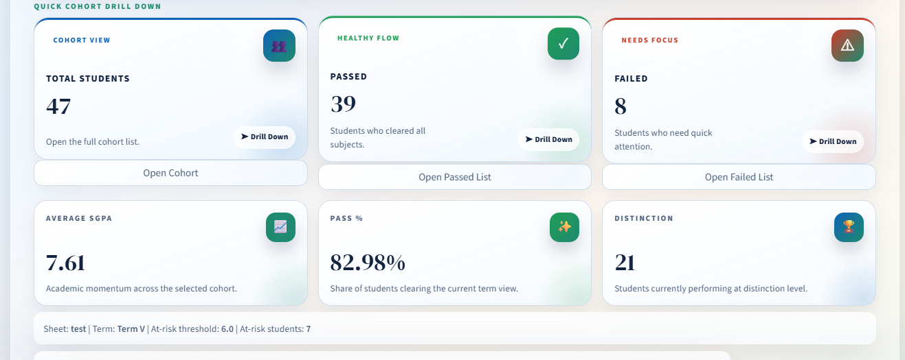

# 📊 Academic Result Intelligence Dashboard (AIRAS)

A **Python + Streamlit based academic result analysis system** that helps faculty and institutions analyze semester result workbooks, track performance, identify toppers, and generate structured reports.

---

## 🚀 Overview

This project simplifies academic result analysis from Excel workbooks 📁.  
It automatically detects key academic fields and presents insights through an **interactive dashboard**.

### 🎯 Key Capabilities:
- 📈 Student result analysis  
- 📊 Subject-wise pass/fail tracking  
- 🧠 SGPA-based performance insights  
- 🏆 Topper identification  
- 🔍 Student-level drill-down reports  
- 📤 Exportable Excel reports  
- 🕘 Upload history tracking  
- 🔐 Faculty login & session management  

---

## ✨ Features

- 🔐 Secure faculty login & account creation  
- 📥 Upload `.xlsx` result workbooks  
- 🤖 Automatic detection of:
  - 🆔 Roll / PRN column  
  - 👤 Student name column  
  - 📊 SGPA / GPA column  
  - 📝 Grade column  
  - 📚 Subject result blocks  
  - 🏫 Term / Semester labels  

---

## 📊 Dashboard Modules

- 📌 **Overview** – Complete class performance summary  
- 📚 **Subject Intelligence** – Subject-wise insights  
- 📄 **Grade Sheet** – Student grade distribution  
- 🔎 **Student Explorer** – Individual student analysis  
- 🕘 **History** – Uploaded file tracking  
- 📤 **Reporting** – Export reports  

---

## 📈 Analytics Features

- 📊 Subject-wise pass percentage  
- ❌ Failed subject matrix (student-wise)  
- 🏆 Topper detection  
- 📉 Performance trends  

---

## 📸 Project Screenshots

  
  

  
  

---

## 🛠️ Tech Stack

- 🐍 Python  
- 🌐 Streamlit  
- 📊 Pandas  
- 📂 Openpyxl  
- 🗄️ SQLite  

---

## 👨‍💻 Author

**Aryan Tribhuvan**  
🎓 CSE (IoT, Cyber Security & Blockchain)  
📊 Aspiring Data Analyst  

---

⭐ If you like this project, consider giving it a star!
